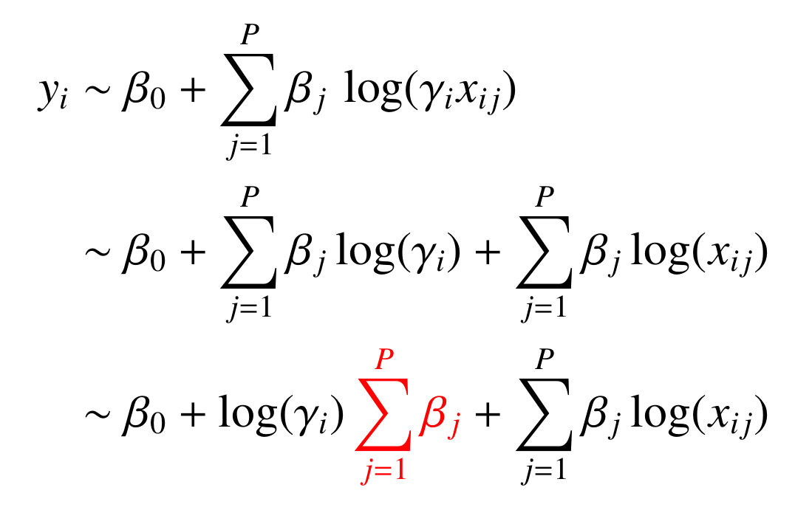
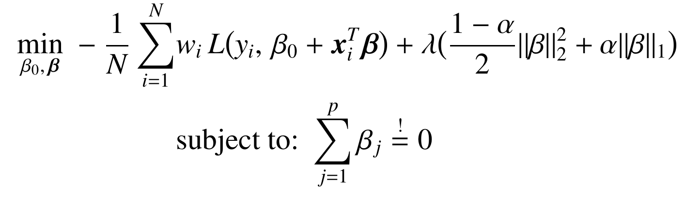
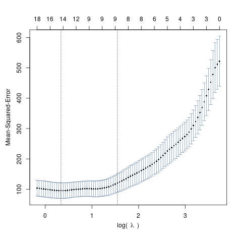
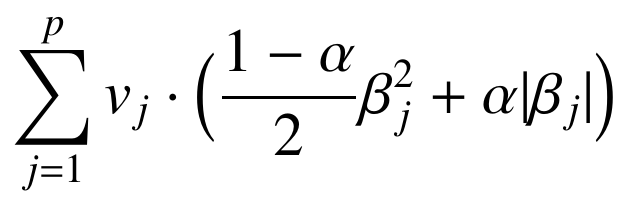

## News: Version 2.0
* Improved support for multinomial logistic and Cox proportional hazards regression.
* Improved performance (runtime avx detection and multithreading support now also available for macOS).
* The function zeroSumCVFit() and zeroSumFit() have been merged to zeroSum().
* The function arguments have been renamed to correspond to the glmnet R package.
  Please see the description below and the examples shown in the corresponding
  example section.

# Introduction: The R-Package zeroSum

*zeroSum* is an R-package for fitting scale invariant and thereby
reference point insensitive log-linear models by imposing the zero-sum
constraint [1] combined with the elastic-net regularization [4].

The zero-sum constraint is recommended for fitting linear models between a
response yi and log-transformed data xi where ambiguities
in the reference point translate to sample-wise shifts. The influence of such
sample-wise shifts &gamma;i on linear models is as follows:

By restricting the sum of coefficients (red) to zero the model becomes reference point insensitive.

This approach of  has been proposed in the context of compositional data in [3] and in the
context of reference points in [1]. The corresponding minimization problem reads:

where L denotes the log-likelihood function of the regression type.
The parameter &alpha; can be used to adjust the ratio between ridge and LASSO regularization.
For &alpha;=0 the elastic-net becomes
a ridge regularization, for &alpha;=1  the elastic-net becomes
the LASSO regularization.

For more details about zero-sum see [1] and [2].

The function calls of the *zeroSum* package follow closely
those of the [*glmnet*](https://cran.r-project.org/web/packages/glmnet/index.html) package [4,5,6]. Therefore, the results of the linear models
with or without the zero-sum constraint can be easily compared.

**Please note that the zero-sum constraint only yields reference point insensitive models on log transformed data!**

# Table of contents
  * [Installation](#installation)
    * [Dependencies](#dependencies)
    * [Windows](#windows)
    * [Linux and macOS](#linux-and-macos)
    * [Devtools](#devtools)
    * [Manual building from source](#manually-building-from-source)
  * [Quick start](#quick-start)
  * [Supported regression types](#supported-regression-types)
  * [FAQ](#faq)
  * [Standalone HPC version](#standalone-hpc-version)
      * [Build instructions](#build-instructions)
      * [Basic usage](#basic-usage)
  * [References](#references)

# Installation

## Dependencies
* The R-package [*Matrix*](https://cran.r-project.org/web/packages/Matrix/index.html)
  is required for sparse matrices. (Part of *R recommended* and should be installed by default)
* The R-package [*testthat*](https://cran.r-project.org/web/packages/testthat/index.html)
  is only required for unit testing.
* For Installation from source or for using devtools::install_github()
  a modern compiler which supports C++11 and AVX512 intrinsics is required.

## Windows
A binary package (*.zip) is available, which can be installed in R
using:

    install.packages("https://github.com/rehbergT/zeroSum/raw/main/zeroSum_2.0.6.zip", repos = NULL)

## Linux and macOS
The source package (*.tar.gz) can be installed in R using:

    install.packages("https://github.com/rehbergT/zeroSum/raw/main/zeroSum_2.0.6.tar.gz", repos = NULL)

## Devtools
The devtools package allows to install packages from github:

    devtools::install_github("rehbergT/zeroSum/zeroSum")

## Manually building from source
Git clone or download this repository and open a terminal within the zeroSum folder.
The source package can be build and installed with:

    R CMD build zeroSum
    R CMD INSTALL zeroSum_2.0.6.tar.gz

# Quick start

Load the *zeroSum* package and the included example data

    library(zeroSum)                # load the R package
    set.seed(3)                     # set a seed for exact same results
    x <- log2(exampleData$x)        # load example data and use log transformation
    y <- exampleData$y

Perform a cross-validation over an automatically approximated &lambda;
sequence to determine the optimal value of the elastic-net regularization:

    fit <- zeroSum(x, y)

use the plot() function to see the CV-error versus the regularization strength &lambda;:

    plot(fit)

The lowest mean squared error indicates the best choice for &lambda;.

The coef() function can be used to extract the coefficients:

    coef(fit)
    > 49 x 1 sparse Matrix of class "dgCMatrix"
    >
    > intercept 37.22608690
    > Feature1  -0.32431232
    > Feature2   1.00806569
    > Feature3   .
    > Feature4   .
    > Feature5   1.35545432
    > ...

Note that the sum of coefficients is zero:

    sum(coef(fit)[-1,])           # -1 to remove the intercept
    > 8.326673e-17

Use the predict() function to make predictions:

    predict(fit, newx=x)
    >             [,1]
    > Sample1   -5.502157
    > Sample2   47.787166
    > Sample3   31.794299
    > Sample4   36.524800
    > Sample5   41.494367
    > ...

# Supported regression types
* **Linear regression** (`family = "gaussian"`, default):

        library(zeroSum)                # load the R package
        x <- log2(exampleData$x)        # load example data and use log transformation
        y <- exampleData$y              # y is a numeric vector

        fit <- zeroSum(x, y, family = "gaussian")

* **Binomial logistic regression** (`family = "binomial"`)

        library(zeroSum)                # load the R package
        x <- log2(exampleData$x)        # load example data and use log transformation
        y <- exampleData$ylogistic      # y is a integer vector containing 1 and 0

        fit <- zeroSum(x, y, family = "binomial")

* **Multinomial logistic regression** (`family = "multinomial"`)

        library(zeroSum)                # load the R package
        x <- log2(exampleData$x)        # load example data and use log transformation
        y <- exampleData$yMultinomial   # y is a integer vector containing 1, 2, 3, ...
                                        # representing the different classes

        fit <- zeroSum(x, y, family = "multinomial")

* **Cox proportional hazard regression** (`family = "cox"`)

        library(zeroSum)                # load the R package
        x <- log2(exampleData$x)        # load example data and use log transformation
        y <- exampleData$yCox           # y is a numeric matrix with two columns and N
                                        # rows. The first column depicts the observation
                                        # time and the second column indicates death (1)
                                        # or right censoring (0).

        fit <- zeroSum(x, y, family = "cox")

# FAQ
* **Adjusting the elastic-net parameter &alpha;:**

    The parameter &alpha; is default set to 1 (LASSO case) and can be adjused with the argument `alpha`. For example:

        library(zeroSum)                # load the R package
        x <- log2(exampleData$x)        # load example data and use log transformation
        y <- exampleData$y              # y is a numeric vector

        fit <- zeroSum(x, y, alpha = 0.9)

* **Manually defining the folds of the cross-validation in order to get reproducible results:**

    The argument `foldid` can be used to manually define the folds of the internal cross-validation which is used to determine the optimal value of &lambda;.
    Thereby, repeated runs yield the exact same result

        library(zeroSum)                                    # load the R package
        x <- log2(exampleData$x)                            # load example data and apply log2()
        y <- exampleData$y                                  # y is a numeric vector
        set.seed(1)                                         # set a seed to get the same foldids
        foldid <- sample(rep(1:10, length.out = nrow(x)))   # randomly assign a fold id for each sample
                                                            # (10 folds in total)

        fit1 <- zeroSum(x, y, foldid = foldid)
        fit2 <- zeroSum(x, y, foldid = foldid)

        cbind(coef(fit1), coef(fit2))
        > 49 x 2 sparse Matrix of class "dgCMatrix"
        >
        > intercept 32.8706621 32.8706621
        > Feature1   .          .
        > Feature2   1.2074393  1.2074393
        > Feature3   .          .
        > Feature4   0.1406724  0.1406724
        > Feature5   0.9506165  0.9506165
        > Feature6   0.5565038  0.5565038
        > ...

    Without pre-defining the folds each zeroSum call will automatically generate random fold ids causing that repeated runs can yield different results.

        fit3 <- zeroSum(x, y)
        fit4 <- zeroSum(x, y)

        cbind(coef(fit3), coef(fit4))
        > 49 x 2 sparse Matrix of class "dgCMatrix"
        >
        > intercept 32.49787458 32.005580496
        > Feature1  -0.06557239 -0.109776390
        > Feature2   1.23434942  1.227301341
        > Feature3   .           .
        > Feature4   0.34301075  1.085574015
        > Feature5   0.85595893  0.586373614
        > Feature6   0.45418722  .

* **Using sample-wise weights**

    The argument `weights` allows to adjust the contribution of each sample to the log-likelihood. This allows for instance to balance different group sizes:

        library(zeroSum)                 # load the R package
        x <- log2(exampleData$x)         # load example data and use log transformation
        y <- exampleData$ylogistic       # y is a integer vector containing 1 and 0
        set.seed(1)                      # set a seed to get the same foldids

        c(sum(y == 0), sum(y == 1))      # the samples are almost balanced
        > 16 15

        weights <- rep(0, nrow(x))       # generate a weight vector where the length
                                         # corresponds to the number of samples
        weights[y == 0] <- rep(1/16, 16)
        weights[y == 1] <- rep(1/15, 15)

        fit <- zeroSum(x, y, weights=weights, family = "binomial")

* **Excluding features from the elastic-net regularization using penalty.factor**

    The argument `penalty.factor` (vi) allows to adjust the contribution of a feature to the elastic-net regualization: (By default each factor is 1)

    

    

    

    For instance, setting the first value of the `penalty.factor` to 0 causes that the first coefficient is not affected by the regularization and will therefore be non-zero:

        library(zeroSum)                                    # load the R package
        x <- log2(exampleData$x)                            # load example data and apply log2()
        y <- exampleData$y                                  # y is a numeric vector
        set.seed(1)                                         # set a seed

        pf <- rep(1, ncol(x))
        pf[1] <- 0

        fit1 <- zeroSum(x, y)
        fit2 <- zeroSum(x, y, penalty.factor = pf)

        cbind(coef(fit1), coef(fit2))
        > 49 x 2 sparse Matrix of class "dgCMatrix"
        >
        > intercept 32.8706621 31.83764044
        > Feature1   .         -2.80130699
        > Feature2   1.2074393  0.91933940
        > Feature3   .          .
        > Feature4   0.1406724  1.24848083
        > Feature5   0.9506165  0.64844358
        > Feature6   0.5565038  .
        > ...

    A penalty.factor of 0 for a specific feature in combination with a zero-sum weight of 0 (see next point) for the same feature can be used for confounding features.

* **Excluding features from the zero-sum constrain using zeroSum.weights**

    The argument `zeroSum.weights` (ui) allows to adjust the zero-sum constraint. Each factor of the constraint is multiplied with with corresponding coefficient: (By default each factor is 1)

    

    

    

    For instance, setting the first value of the `zeroSum.weights` to 0 causes that the first coefficient is not affected by the zero-sum constraint. Thus, the sum of coefficents excluding the first coefficient will be zero:

        library(zeroSum)                                    # load the R package
        x <- log2(exampleData$x)                            # load example data and apply log2()
        y <- exampleData$y                                  # y is a numeric vector
        set.seed(1)                                         # set a seed

        zw <- rep(1, ncol(x))
        zw[1] <- 0

        fit1 <- zeroSum(x, y)
        fit2 <- zeroSum(x, y, zeroSum.weights = zw)

        sum(coef(fit1)[-1, ])                               # -1 because of the intercept
        > [1] -3.996803e-15

        sum(coef(fit2)[-1, ])                               # -1 because of the intercept
        [1] -0.1745896                                      # non zero because the first element
                                                            # is excluded from the constraint

        sum(coef(fit2)[-c(1:2), ])                          # the sum of all features except
        > [1] -3.996803e-15                                 # the intercept and the first feature is 0

    A zeroSum.weight of 0 for a specific feature in combination with a penalty.factor of 0 for the same feature can be used for confounding features.

* **Disabling the zero-sum contraint:**

    The zero-sum constraint can be disabled by using the argument `zeroSum = FALSE`, which should yield results equivalent to the [*glmnet*](https://cran.r-project.org/web/packages/glmnet/index.html) package with `standardize = FALSE`. For example:

        library(zeroSum)                # load the R package
        set.seed(1)
        x <- log2(exampleData$x)        # load example data and use log transformation
        y <- exampleData$y              # y is a numeric vector

        fit <- zeroSum(x, y, zeroSum = FALSE)

    The sum of all coefficients (without the intercept) is thus non-zero:

        sum(coef(fit)[-1, ])
        > [1] -0.7952836

# Standalone HPC version

*zeroSum* is available as a standalone C++ program which allows
an easy utilization on computing clusters. Note that the mpi parallelization can only
be used for the fused LASSO regularization.

## Build instructions
Git clone or download this repository and a open a terminal within the zeroSum/hpc_version folder.
Build the *zeroSum* hpc version with:

    make

By default the Makefile is configured to compile *zeroSum* for the currently used architecture (`native`).
This can be adjusted at the top of the Makefile.

### Basic usage

We provide R functions for exporting all necessary files for the standalone HPC version and for importing the generated results.

Open a terminal and create an empty folder. Change the working directory to the created folder. Load *zeroSum* and the example data:

    library(zeroSum)
    set.seed(1)
    x <- log2(exampleData$x)
    y <- exampleData$y

The exportToCSV() function has the same arguments as zeroSum() but with the additional arguments *name* and *path*.
With *name* one can set the prefix name of all exported files and with *path* the path for exporting the files can be determined.

    exportToCSV( x, y, name="test", path="./" )

4 files are now generated:

    $ ls
    rDataObject_test.rds  settingstest.csv  xtest.csv  ytest.csv

The .rds file is only necessary for importing the results and only the other 3 have to be passed to the HPC *zeroSum* version as follows:

    mpirun -np 1 /path/to/hpcVersion/zeroSum settingstest.csv xtest.csv ytest.csv ./ example

The last two arguments determine the path where the results should be saved and the of name the file in which the results should be saved:

    $ ls
    example_0_stats.csv  rDataObject_test.rds  settingstest.csv  xtest.csv  ytest.csv

As one can see the file example_0_stats.csv containing the results has been created.
One can now import the file back into R with the importFromCSV() function:

    library(zeroSum)
    cv.fit <- importFromCSV("rDataObject_test.rds", "example" )

    head( coef(cv.fit, s="lambda.min") )
                    [,1]
    intercept 27.3026110
    Feature1   0.0000000
    Feature2   0.7558415
    Feature3   0.0000000
    Feature4   0.3207761
    Feature5   0.5220436

The same coefficients as above have been obtained (despite some numerical uncertainty).

## References
[1] M. Altenbuchinger, T. Rehberg, H. U. Zacharias, F. Staemmler, K. Dettmer, D. Weber, A. Hiergeist, A. Gessner, E. Holler, P. J. Oefner, R. Spang. Reference point insensitive molecular data analysis. Bioinformatics 33(2):219, 2017. doi: 10.1093/bioinformatics/btw598

[2] H. U. Zacharias, T. Rehberg, S. Mehrl, D. Richtmann, T. Wettig, P. J. Oefner, R. Spang, W. Gronwald, M. Altenbuchinger. Scale-invariant biomarker discovery in urine and plasma metabolite fingerprints. J. Proteome Res. doi: 10.1021/acs.jproteome.7b00325, ArXiv e-prints. <http://arxiv.org/abs/1703.07724>

[3] Wei Lin, Pixu Shi, Rui Feng, and Hongzhe Li. Variable selection in regression with compositional covariates. Biometrika, 2014. doi: 10.1093/biomet/asu031.

[4] H. Zou and T. Hastie. Regularization and variable selection via the elastic
net. Journal of the Royal Statistical Society: Series B (Statistical Methodology), 67(2):301-320, 2005.

[5] J. Friedman, T. Hastie, and R. Tibshirani. Regularization paths for generalized linear models via coordinate descent. Journal of Statistical Software, 33(1):1-22, 2010. ISSN 1548-7660. doi: 10.18637/jss.v033.i01.

[6] N. Simon, J. Friedman, T. Hastie, and R. Tibshirani. Regularization paths for cox's proportional
hazards model via coordinate descent. Journal of Statistical Software, 39(1):1-13, 2011. ISSN
1548-7660. doi: 10.18637/jss.v039.i05.
